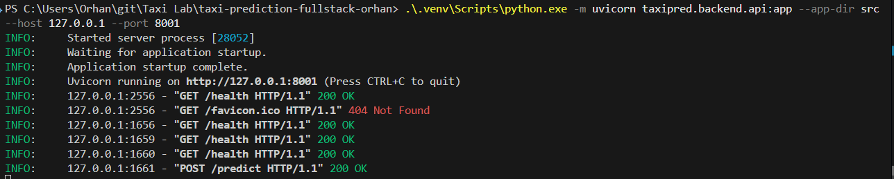
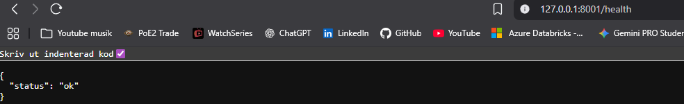
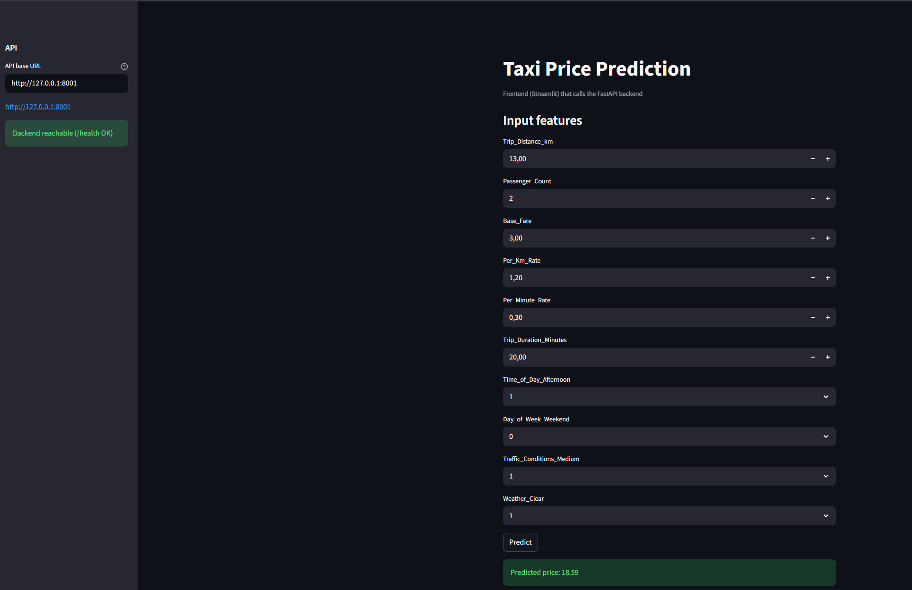

# Taxiprediktion (Fullstack-labb)

Ett labbprojekt från början till slut: träna en modell för taxipris, exportera artifacts, servera prediktioner via ett backend-API och konsumera API:t från ett enkelt frontend-UI.

## Arkitektur

- **Modellutveckling**: Jupyter-notebook(s) under `src/taxipred/model_development/`
- **Modell-artifacts**: exporteras till repo-roten
  - `linear_regression_model.pkl`
  - `model_features.pkl`
- **Backend (FastAPI)**: `src/taxipred/backend/api.py`
- **Frontend (Streamlit)**: `src/taxipred/frontend/app.py`

## Installation (rekommenderat: uv)

Från repo-roten:

- Installera beroenden + skapa/uppdatera `.venv`:
  - `uv sync`

Noteringar:
- Detta repo innehåller `requirements.txt`, men primär workflow här är `uv` (via `pyproject.toml` + `uv.lock`).
- I VS Code-notebooks: välj kernel som pekar på `taxi-prediction-fullstack-orhan\.venv\Scripts\python.exe`.

## Kör backend (FastAPI)

- Starta API (Windows-vänligt):
  - `.\.venv\Scripts\python.exe -m uvicorn taxipred.backend.api:app --app-dir src --host 127.0.0.1 --port 8001`

Endpunkter:
- `GET /health` → `{ "status": "ok" }`
- `GET /data/sample?n=5` → returnerar några rader från CSV:n
- `POST /predict` → returnerar `{ "predicted_price": <float> }`

Exempelanrop:

```bash
curl -X POST http://127.0.0.1:8001/predict \
  -H "Content-Type: application/json" \
  -d '{
    "Trip_Distance_km": 10,
    "Passenger_Count": 2,
    "Base_Fare": 3,
    "Per_Km_Rate": 1.2,
    "Per_Minute_Rate": 0.3,
    "Trip_Duration_Minutes": 20,
    "Time_of_Day_Afternoon": 1,
    "Day_of_Week_Weekend": 0,
    "Traffic_Conditions_Medium": 1,
    "Weather_Clear": 1
  }'
```

## Kör frontend (Streamlit)

Starta UI:t:

```bash
.\.venv\Scripts\python.exe -m streamlit run src/taxipred/frontend/app.py
```

Frontend anropar backenden på `http://127.0.0.1:8000` som standard.
Om du vill peka den någon annanstans:

```bash
set TAXIPRED_API_BASE=http://127.0.0.1:8001
.\.venv\Scripts\python.exe -m streamlit run src/taxipred/frontend/app.py
```

## Kör notebooks

- Öppna `src/taxipred/model_development/01_eda.ipynb`
- Välj kernel från `.venv`

Om du får `ModuleNotFoundError` betyder det oftast att notebooken använder fel interpreter.


### Backend igång



Notering: `GET /favicon.ico 404` i terminalen är normalt (webbläsaren ber om en ikon).

### Backend-status



### Frontend igång


### Frontend-prediktion

